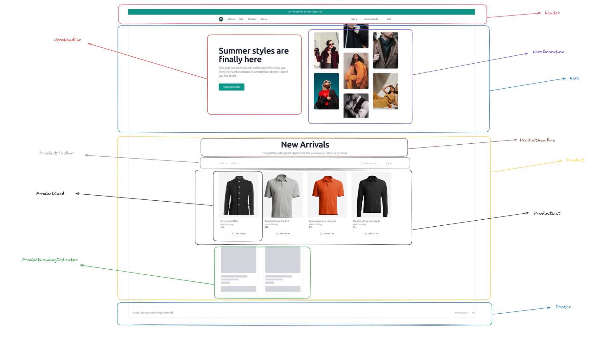

# E-commerce Product

A simple e-commerce product listing application built with React, showing products from FakeStore API with cart functionality.

## Project Components



## Features

- View all products in a responsive grid layout
- Add/Remove products to cart
- View cart summary with total
- Filter products by category
- Sort products by price
- Responsive design for all devices

## Tech Stack

- React + Vite
- Tailwind CSS
- FakeStore API

## Getting Started

1. Clone the repository

```bash
git clone https://github.com/abdulaziz-bd/ecommerce-product.git
```

2. Install dependencies

```bash
npm install
```

3. Run the development server

```bash
npm run dev
```

## Available Scripts

- `npm run dev` - Start development server
- `npm run build` - Build for production
- `npm run preview` - Preview production build

## License

Distributed under the MIT License. See `LICENSE` for more information.

## Live Demo

You can access the live demo of the Project Manager Application [here](https://ecommerce-product-ten.vercel.app/).

## Contact

Md Abdul Aziz - [@abdulazizfahad](https://www.linkedin.com/in/abdulazizfahad/) - <abdulazizbd17@gmail.com>

Project Link: [https://github.com/abdulaziz-bd/ecommerce-product](https://github.com/abdulaziz-bd/ecommerce-product)
